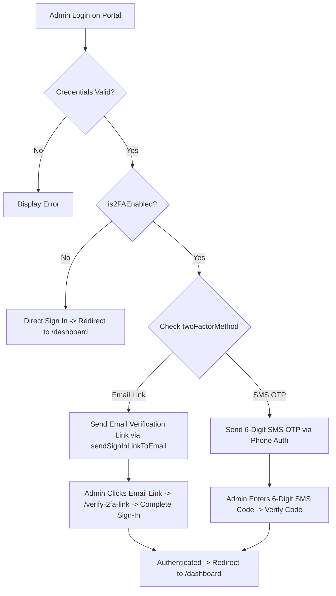

# Technical Implementation Plan: Admin Web Portal 2FA

This plan details the step-by-step implementation of **Two-Factor Authentication (2FA)** for the **Admin Web Portal** (`web/admin_portal`), using **Firebase Email Verification Links** and **SMS OTP**.

---

## 1. 2FA Methods & Mechanics

### Method 1: Email Verification Link (Passwordless Link)
1. When an admin signs in with Email & Password and has Email 2FA enabled, Firebase Auth dispatches a **SignInLinkToEmail** using `sendSignInLinkToEmail(auth, email, actionCodeSettings)`.
2. `actionCodeSettings` specifies `url: "http://localhost:3000/verify-2fa-link"` (or `https://onlygigz-33557.firebaseapp.com`).
3. The admin receives the email in Gmail and clicks the verification link.
4. The link opens `/verify-2fa-link` on the portal (or Firebase Web Landing), which executes `signInWithEmailLink(auth, email, window.location.href)`.
5. Upon confirmation, Firebase authenticates the session and redirects directly to `/dashboard`.

### Method 2: SMS OTP
1. When SMS 2FA is enabled, Firebase Web Auth / backend sends a 6-digit SMS code to the admin's verified phone number.
2. The admin enters the 6-digit SMS code on `/verify-2fa`.
3. Upon confirmation, the portal authenticates the session and redirects to `/dashboard`.

---

## 2. Settings Page UI (`http://localhost:3000/settings`)

- **New Sidebar Tab**: Add **"Security & 2FA"** to the left-hand navigation menu in `web/admin_portal/src/app/(dashboard)/settings/page.tsx`.
- **UI Components**:
  - **Enable 2FA Toggle**: Switch 2FA ON / OFF.
  - **Method Selector**:
    - **Email Verification Link**: Sends a secure sign-in link to Gmail.
    - **SMS OTP**: Sends a 6-digit SMS code to mobile phone.
  - **Phone Number Input**: Visible and required when SMS OTP is selected.
  - **Save Button**: Updates Firestore `admins/{uid}` with `is2FAEnabled`, `twoFactorMethod` (`"email_link"` or `"sms_otp"`), and `phoneNumber`.

---

## 3. Architecture & Flowchart

---

## 4. Files to Modify

### 4.1 [MODIFY] [page.tsx (Settings)](file:///Users/muhammadali3000/development/onlygigz/web/admin_portal/src/app/(dashboard)/settings/page.tsx)
- Add `"security_2fa"` to `SettingsTab` union type.
- Add `{ id: "security_2fa", label: "Security & 2FA", icon: KeyRound }` to `sidebarItems`.
- Render **Security & 2FA** settings card:
  - 2FA Toggle switch.
  - Radio options: **Email Verification Link** vs **SMS OTP**.
  - Phone number input.
  - Save button updating `admins/{uid}` in Firestore.

### 4.2 [MODIFY] [page.tsx (Verify 2FA)](file:///Users/muhammadali3000/development/onlygigz/web/admin_portal/src/app/(auth)/verify-2fa/page.tsx)
- Inspect `pendingUser.twoFactorMethod`:
  - If `"email_link"`: Triggers `sendSignInLinkToEmail` -> displays *"Verification link sent to your email inbox. Click the link to complete sign-in."*
  - If `"sms_otp"`: Triggers SMS code dispatch -> displays 6-digit SMS code input.

### 4.3 [NEW] [page.tsx (Verify Email Link Landing)](file:///Users/muhammadali3000/development/onlygigz/web/admin_portal/src/app/(auth)/verify-2fa-link/page.tsx)
- Catches incoming Firebase Email Link (`isSignInWithEmailLink`).
- Executes `signInWithEmailLink`, completes authentication, and redirects to `/dashboard`.

---

## 5. Verification Plan

1. **Build Check**: `cd web/admin_portal && npm run build`
2. **Settings Tab Check**: Open `http://localhost:3000/settings`, navigate to **Security & 2FA** tab, toggle 2FA on, select **Email Verification Link** or **SMS OTP**, and save.
3. **Email Link Login Test**: Sign in -> Click email link in Gmail -> Verify successful redirection to `/dashboard`.
4. **SMS OTP Login Test**: Sign in -> Enter SMS OTP -> Verify successful redirection to `/dashboard`.
