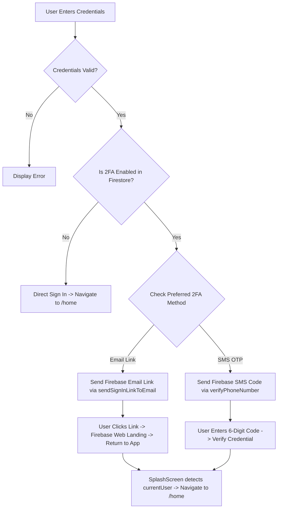

# Comprehensive Implementation Plan: 2FA Setup for Organizer Mobile App & Admin Web Portal

This plan details the complete technical implementation of **Two-Factor Authentication (2FA)** across:
1. **Organizer Mobile App (Flutter)**: Dual-method 2FA supporting both **Email Verification Link** and **SMS OTP**.
2. **Admin Web Portal (React + Vite)**: **SMS OTP** 2FA for administrative security.

---

## 1. Complete Mechanics of Email Verification Link 2FA

When a user selects **Email Link** as their preferred 2FA method:

1. **Password Authentication**:
   - The user enters their email & password on the Sign-In screen.
   - `FirebaseAuth.instance.signInWithEmailAndPassword(...)` executes, authenticating the user in Firebase Auth.
2. **2FA Check & Redirection**:
   - The app checks Firestore (`organizers/{uid}`) for `is2FAEnabled` and `twoFactorMethod`.
   - If 2FA is enabled and method is `'email'`, the app navigates to `TwoFactorVerificationScreen`.
3. **Dispatching Email Link**:
   - The app invokes `FirebaseAuth.instance.sendSignInLinkToEmail(email: email, actionCodeSettings: ActionCodeSettings(url: 'https://onlygigz-33557.firebaseapp.com', handleCodeInApp: true))`.
4. **User Action & Hosting Landing Page**:
   - The user receives an email from Firebase in Gmail with a link to `https://onlygigz-33557.firebaseapp.com/?apiKey=...&oobCode=...`.
   - Tapping the link opens Firebase Hosting (`onlygigz-33557.firebaseapp.com`), which displays our custom dark-mode landing page:
     - **`✓ Email Link Verified!`**
     - **`Return to Mobile App`** button (`intent://#Intent;scheme=onlygigz;package=com.onlygigz.organizer;end`).
5. **Auto-Routing to Home Screen**:
   - Clicking **Return to Mobile App** re-opens the Flutter app.
   - `SplashScreen` checks `FirebaseAuth.instance.currentUser`.
   - Because the session is active, `SplashScreen` automatically routes the user directly to **`/home`** (Home Screen), completing 2FA seamlessly!

---

## 2. Requirements Overview

### A. Organizer Mobile App (Flutter)
- **Settings Screen (`settings_screen.dart`)**: Add a dynamic 2FA status tile displaying `Enabled` or `Disabled`.
- **2FA Management Screen (`/profile/2fa`)**:
  - Allows organizers to toggle 2FA **On / Off**.
  - Allows selecting the preferred method: **SMS OTP** or **Email Verification Link**.
  - If selecting SMS OTP without a saved phone number, prompt for phone number before saving.
- **2FA Verification Screen during Sign-In (`two_factor_verification_screen.dart`)**:
  - Automatically fetches the organizer's preferred 2FA method from Firestore (`organizers/{uid}`).
  - If method is **SMS OTP**, sends code via Firebase Auth SMS and provides a 6-digit PIN input with a 120-second resend cooldown (`timeout: const Duration(seconds: 120)` and `forceResendingToken: _resendToken`).
  - If method is **Email**, sends Email Link via `sendSignInLinkToEmail`.
  - Includes a **Cancel** button that logs out of Firebase (`AuthService.signOut()`) and returns cleanly to `/signin` (`pushNamedAndRemoveUntil`).
  - Wrapped in `SingleChildScrollView` to prevent keyboard UI bottom overflow (102px issue).

### B. Admin Web Portal (React + Vite)
- **Sign-In Flow with SMS 2FA**:
  - After entering admin credentials (email & password), if 2FA is enabled for the admin account, display an interactive modal/screen requesting SMS OTP verification using Firebase Web Auth (`recaptchaVerifier` & `signInWithPhoneNumber`).
  - Upon successful OTP verification, store the session token and navigate to `/dashboard`.
- **Settings / Security Tab**:
  - Allow admin users to enable/disable SMS 2FA and configure their verified phone number.

---

## 3. System Flowchart

---

## 4. Component Implementation Breakdown

### Component 1: Organizer Mobile Application (Flutter)

#### 1.1 [MODIFY] [settings_screen.dart](file:///Users/muhammadali3000/development/onlygigz/apps/organizer/lib/screens/profile/settings_screen.dart)
- **Changes**: Add Firestore listener for `organizers/{uid}` -> bind `is2FAEnabled` dynamically to the list tile subtitle (`Enabled` / `Disabled`).

#### 1.2 [MODIFY] [two_factor_authentication_screen.dart (Profile)](file:///Users/muhammadali3000/development/onlygigz/apps/organizer/lib/screens/profile/two_factor_authentication_screen.dart)
- **Changes**: Implement selection cards for SMS vs Email 2FA. `_toggle2FA()` checks if `twoFactorMethod == 'sms'` before asking for phone number.

#### 1.3 [MODIFY] [two_factor_verification_screen.dart (Auth)](file:///Users/muhammadali3000/development/onlygigz/apps/organizer/lib/screens/auth/two_factor_verification_screen.dart)
- **Changes**: Wrap body in `SingleChildScrollView`. Implement SMS OTP with 120s timeout and `forceResendingToken`. Update Cancel/Back handler to call `AuthService.signOut()` and `pushNamedAndRemoveUntil('/signin')`.

#### 1.4 [MODIFY] [auth_service.dart](file:///Users/muhammadali3000/development/onlygigz/apps/organizer/lib/services/auth_service.dart)
- **Changes**: `signOut()` resets `_user = null` and calls `notifyListeners()`. `sendSmsOtp()` includes `timeout: const Duration(seconds: 120)` and `forceResendingToken: resendToken`.

---

### Component 2: Admin Web Portal (React + Vite)

#### 2.1 [MODIFY] [LoginPage.jsx](file:///Users/muhammadali3000/development/onlygigz/web/admin_portal/src/pages/LoginPage.jsx)
- **Changes**: Add invisible `RecaptchaVerifier`, trigger `signInWithPhoneNumber`, prompt for 6-digit OTP code before navigating to `/dashboard`.

#### 2.2 [MODIFY] [SecuritySettings.jsx](file:///Users/muhammadali3000/development/onlygigz/web/admin_portal/src/pages/SecuritySettings.jsx)
- **Changes**: Admin toggle for 2FA on/off and phone number setup.

---

## 5. Verification Steps

1. **Flutter Apps Static Analysis**: `cd apps/organizer && flutter analyze`
2. **Admin Portal Build Verification**: `cd web/admin_portal && npm run build`
3. **Manual 2FA Verification**:
   - Test Email 2FA link flow (email link -> web landing page -> Return to app -> Home screen).
   - Test SMS 2FA flow (6-digit OTP -> Home screen).
   - Test Keyboard visibility (no 102px overflow).
   - Test Cancel / Logout (session destroyed).
